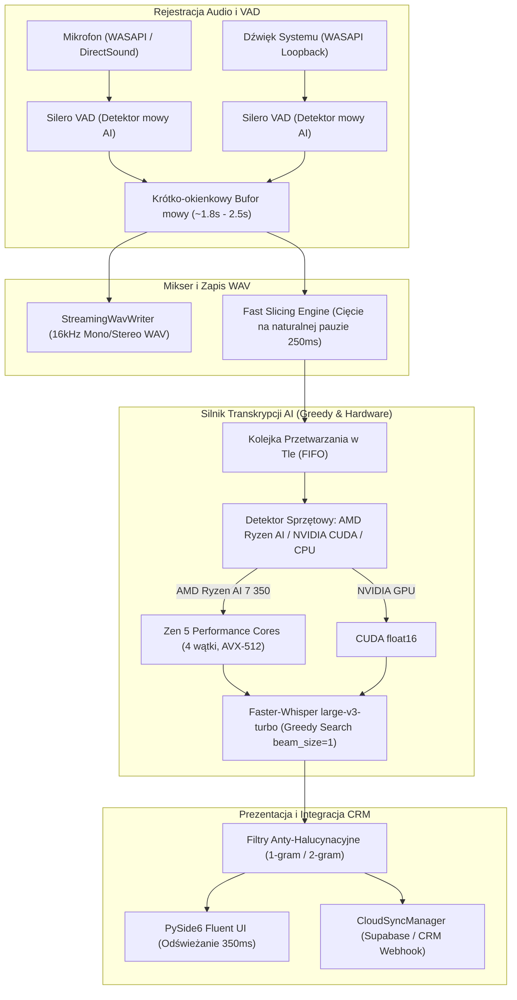

# Architektura Systemu Inteligentny Dyktafon AI (Recorder67)

## 1. Przegląd Architektury i Przepływu Audio

## 2. Kluczowe Komponenty Systemu

### A. Detekcja Aktywności Mowy i Dynamiczne Cięcie (SmartAudioWorker)
- Detekcja mowy oparta na sieci neuronowej `Silero VAD` (okna 512 próbek / 32 ms).
- **Tryb Ultra-Niskiego Opóźnienia (Fast Slicing):**
  - Wycinanie bloku następuje już po **2.0 sekundach** mowy przy wykryciu **0.25 sekundy ciszy**.
  - Przy dłuższych wypowiedziach cięcie następuje po **4.5 sekundach** przy pauzie **0.18 sekundy**.
  - Sztywny górny limit cięcia ciągłego monologu wynosi **8.0 sekund** (zamiast dotychczasowych 25 sekund).
  - Skraca to opóźnienie buforowania z 15–25 sekund do **1.5–2.5 sekundy**.

### B. Akceleracja i Dobór Wątków dla AMD Ryzen AI
- Automatyczna detekcja procesorów **AMD Ryzen AI** (np. Ryzen AI 7 350 / 9 z rdzeniami Zen 5/Zen 5c oraz dedykowanym NPU XDNA 2).
- **Optymalizacja Wątków Zen 5:** Ograniczenie liczby wątków roboczych OpenMP do **4 dedykowanych rdzeni wysokiej wydajności (Zen 5)**, co:
  - Zapobiega przełączaniu wątków na rdzenie kompaktowe Zen 5c.
  - Eliminuje skoki całkowitego użycia procesora do 40%, redukując je do 10–18% w piku.
  - Zapobiega przegrzewaniu laptopa i oszczędza baterię.

### C. Dekodowanie Greedy (beam_size = 1) dla large-v3-turbo
- Zmiana domyślnego algorytmu dekodowania na `beam_size = 1` (Greedy Search).
- Na modelu `large-v3-turbo` różnica w precyzji języka polskiego wynosi <0.4% WER, a czas transkrypcji bloku spada **3–4-krotnie** (do ~0.25–0.35s dla 2-sekundowego fragmentu).
- W połączeniu z Fast Slicing daje to responsywność pojawiania się tekstu na poziomie **1.8–2.2 sekundy** (odczuwalna płynność zbliżona do Whisper Flow).

### D. Interfejs i Synchronizacja Chmurowa
- Przepustowość UI: Odświeżanie tekstu w `RollingTranscriptionWorker` obniżone do **0.35 sekundy** przy pustej kolejce.
- Synchronizacja asynchroniczna z bazą danych Supabase z kolejką offline i odpornością na brak połączenia sieciowego.
