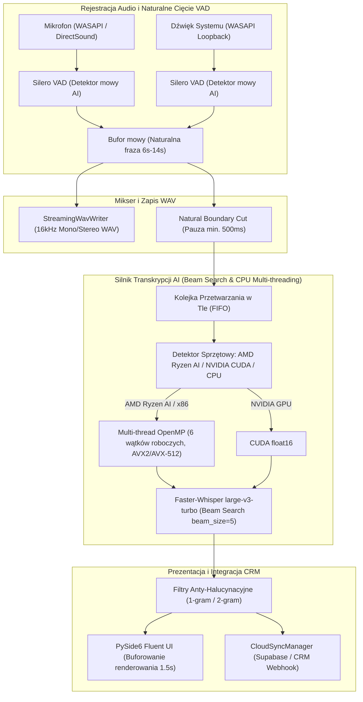

# Architektura Systemu Inteligentny Dyktafon AI (Recorder67)

## 1. Przegląd Architektury i Przepływu Audio

## 2. Kluczowe Komponenty Systemu i Zasady Projektowe

### A. Detekcja Aktywności Mowy i Naturalne Granice Zdań (SmartAudioWorker)
- Detekcja mowy oparta na sieci neuronowej `Silero VAD` (okna 512 próbek / 32 ms).
- **Zasada Spójnego Zdania (Context-Preserving Boundary):**
  - Wycinanie bloku następuje po **6.0 sekundach** mowy przy wykryciu **0.5 sekundy ciszy** (naturalny oddech / koniec zdania) lub po **14.0 sekundach** (pauza 0.3s).
  - Sztywny górny limit monologu wynosi **25.0 sekund**.
  - **Uzasadnienie techniczne:** Whisper to model sekwencyjny typu Transformer wytrenowany na 30-sekundowych oknach. Pocięcie mowy na fragmenty < 2s pozbawia model kontekstu gramatycznego i składniowego, prowadząc do zniekształceń fonetycznych i halucynacji. Zbieranie pełnych fraz daje najwyższą precyzję języka polskiego i pozwala procesorowi odpoczywać (0% CPU) między zdaniami.

### B. Próbkowanie Wiązkowe (Beam Size = 5) dla Bezkompromisowej Jakości
- Domyślny parametr `whisper_beam_size = 5`.
- W odróżnieniu od zachłannego dekodowania (Greedy Search `beam=1`), Beam Search weryfikuje 5 alternatywnych ścieżek hipotez, co jest kluczowe w języku polskim dla bezbłędnego rozpoznawania końcówek fleksyjnych, nazw własnych oraz eliminacji obcojęzycznych halucynacji w obecności szumu.

### C. Alokacja Wątków dla Procesorów AMD Ryzen AI i CPU
- Automatyczna detekcja procesorów **AMD Ryzen AI** i standardowych jednostek x86.
- Alokacja 6 wątków obliczeniowych (`min(6, total_cores - 1)`) gwarantuje maksymalną wydajność biblioteki CTranslate2 z zachowaniem wolnych rdzeni dla płynności interfejsu GUI (PySide6).

### D. Zero-Crash Fallback dla Dowolnego Środowiska
- Bezpieczny blok `try...except` przy odpytywaniu rejestru Windows.
- Automatyczne przełączenie na uniwersalny profil CPU `int8` AVX na komputerach bez NPU (Intel Core, maszyny wirtualne, starsze Ryzeny).

### E. Interfejs i Buforowanie Renderowania HTML
- Odświeżanie podglądu transkrypcji buforowane do **1.5 sekundy**, co zapobiega zacinaniu pętli zdarzeń Qt i minimalizuje narzut na procesor.
